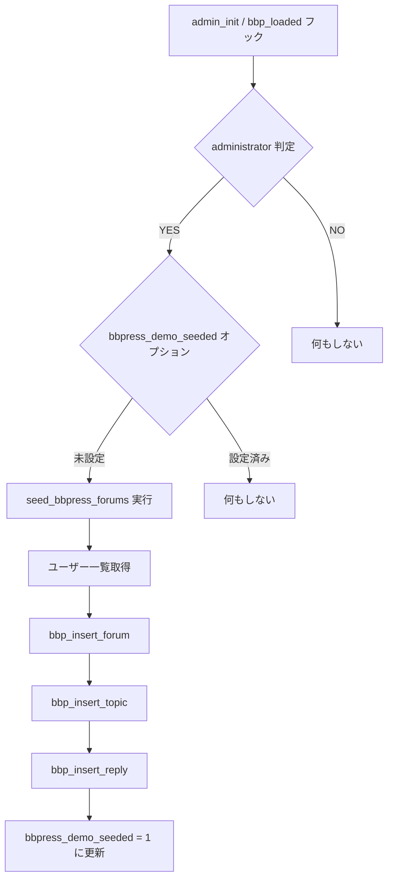

# bbPress Seed Data 処理フロー


---
```
twentysixteen-child/
├── includes/
│   ├── bbpress-seed.php        ← 実行本体
│   └── bbpress-structure.php   ← データ定義（別ファイル）

```
---

## 処理フロー（Mermaid 図）



---

## 使用されている bbPress 関数

| 関数名               | 説明                                      |
|----------------------|-------------------------------------------|
| `bbp_insert_forum()` | フォーラムの投稿を作成。副作用込み       |
| `bbp_insert_topic()` | トピックの投稿を作成。副作用込み         |
| `bbp_insert_reply()` | 返信の投稿を作成。親トピックを更新 etc.  |
| `update_option()`    | シード済みフラグをセット                  |
| `get_users()`        | 投稿者として使用する WPユーザー一覧取得  |

---

## なぜ bbPress API を使うのか

bbPress は `forum`, `topic`, `reply` をカスタム投稿タイプとして扱っているが、それぞれ投稿後に関連メタ情報や統計情報を処理する必要がある。  
そのため、標準の `wp_insert_post()` を直接使うと以下のような副作用が発生しないため、**正常に動作しない投稿**になる。

**具体的な副作用（例）**

- 親フォーラム・トピックの `reply_count`, `last_active` 更新
- タクソノミー（公開設定、可視性など）の付与
- メタ情報の初期化

---


## URL トリガによる再投入・削除

以下のパラメータを `wp-admin` に付加することで、シードデータの挿入・削除を制御できる。

| パラメータ             | 効果                          |
|------------------------|-------------------------------|
| `?run_bbp_seed=1`      | データ再投入                  |
| `?delete_all_bbp` | |
---
