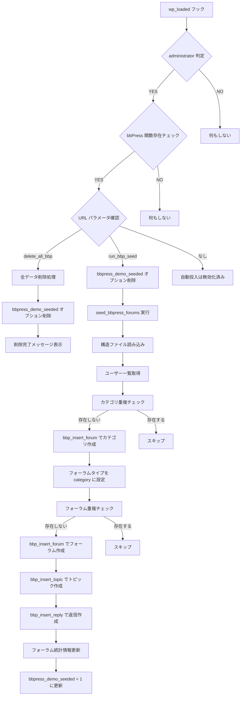

# bbPress Seed Data 処理フロー


---
```
twentysixteen-child/
├── includes/
│   ├── bbpress-seed.php        ← 実行本体
│   └── bbpress-structure.php   ← データ定義（別ファイル）

```
---

## 処理フロー（Mermaid 図）



---

## 使用されている bbPress 関数

| 関数名                           | 説明                                      |
|----------------------------------|-------------------------------------------|
| `bbp_insert_forum()`             | フォーラムの投稿を作成。副作用込み       |
| `bbp_insert_topic()`             | トピックの投稿を作成。副作用込み         |
| `bbp_insert_reply()`             | 返信の投稿を作成。親トピックを更新 etc.  |
| `bbp_update_forum_type()`        | フォーラムタイプを設定（カテゴリ等）     |
| `bbp_update_forum_topic_count()` | フォーラムのトピック数を更新             |
| `bbp_update_forum_reply_count()` | フォーラムの返信数を更新                 |
| `bbp_update_forum_subforum_count()` | フォーラムのサブフォーラム数を更新   |
| `bbp_update_forum_last_topic_id()` | フォーラムの最新トピックIDを更新     |
| `bbp_update_forum_last_reply_id()` | フォーラムの最新返信IDを更新         |
| `update_option()`                | シード済みフラグをセット                  |
| `get_users()`                    | 投稿者として使用する WPユーザー一覧取得  |
| `wp_delete_post()`               | 投稿を完全削除（ゴミ箱を経由しない）     |

---

## なぜ bbPress API を使うのか

bbPress は `forum`, `topic`, `reply` をカスタム投稿タイプとして扱っているが、それぞれ投稿後に関連メタ情報や統計情報を処理する必要がある。  
そのため、標準の `wp_insert_post()` を直接使うと以下のような副作用が発生しないため、**正常に動作しない投稿**になる。

**具体的な副作用（例）**

- 親フォーラム・トピックの `reply_count`, `last_active` 更新
- タクソノミー（公開設定、可視性など）の付与
- メタ情報の初期化
- 統計情報の自動計算・更新

---

## URL トリガによる再投入・削除

以下のパラメータを `wp-admin` に付加することで、シードデータの挿入・削除を制御できる。

| パラメータ             | 効果                          |
|------------------------|-------------------------------|
| `?run_bbp_seed`      | データ再投入                  |
| `?delete_all_bbp`      | 全データ削除                  |

**注意事項**
- 自動投入機能は現在無効化されています（コメントアウト）
- 管理者権限が必要です
- bbPress プラグインが有効である必要があります

---

## 重複チェック機能

既存のデータとの重複を防ぐため、以下のチェックが実装されています：

1. **カテゴリ重複チェック**: `WP_Query` を使用してタイトルで既存カテゴリを検索
2. **フォーラム重複チェック**: `WP_Query` を使用してタイトルで既存フォーラムを検索
3. **シード済みフラグ**: `bbpress_demo_seeded` オプションで初回実行のみ制御

重複が検出された場合は、該当項目をスキップして処理を継続します。
